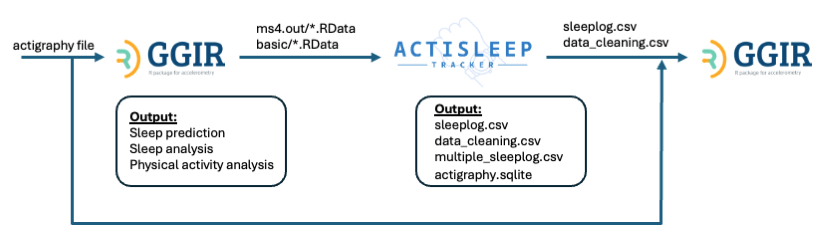
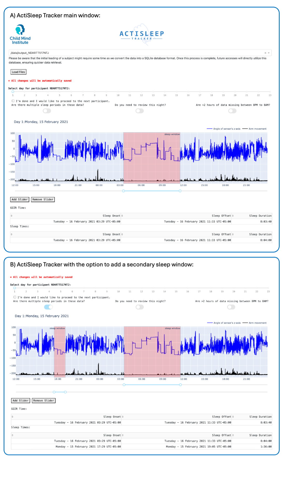
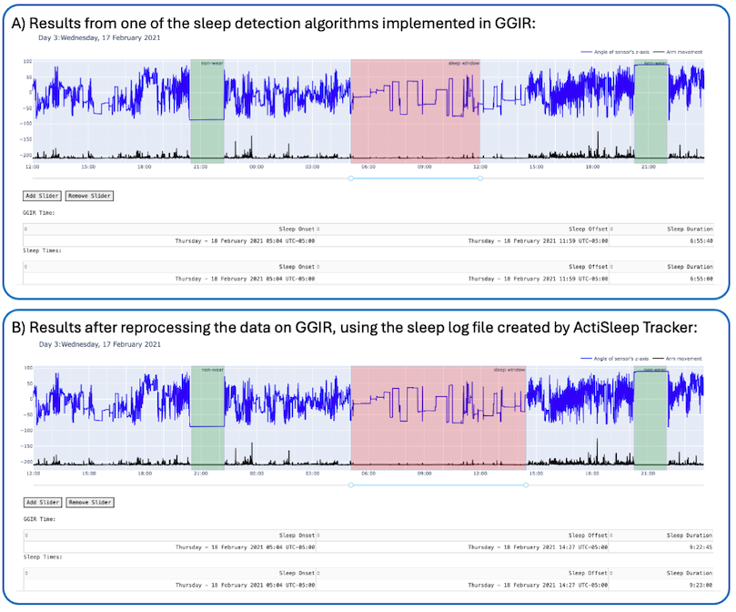

# Summary

ActiSleep Tracker is a Python-based dashboard that facilitates the manual refinement of automatically generated sleep annotations from wrist-worn accelerometer data produced by GGIR, a widely used open-source R package. The results from GGIR can be uploaded to ActiSleep Tracker, wherein they can be reviewed, annotated, or revised. After confirming the annotations, ActiSleep Tracker generates an updated sleep log and a change-summary file from the participant’s data, which can be used for further data cleaning, processing, and analysis.

# Statement of need

The recommended procedure for studies collecting actigraphy data is for participants to maintain a sleep diary. The sleep diary should have all relevant information about the participant’s night, and it can contain one or more of the following: time in bed, approximate time that sleeping started, wake-up time, sleep duration, nap time, any sleep disturbances or disruptions, and/or overall sleep quality. Obtaining an accurate sleep diary can be challenging, especially with young children [@Tetreault2018-lq]. Non-adherence to completing the sleep diary significantly reduces the quality of data and, in some cases, the number of nights' worth of data available for analysis, resulting in a loss of statistical power [@Acebo1999-wk;@Werner2008-ll]. There are several data-driven approaches to constructing sleep logs from wrist-worn accelerometer data, such as those packaged within GGIR [@Van_Hees2025-ct]. However, there are several limitations in implementing this algorithm that limit its estimation of sleep windows, including brief wake periods, multiple disconnected sleep periods, restful periods before sleep, and/or periods of restlessness during sleep [@Ancoli-Israel2003-jv;@Sadeh2002-ni;@Smith2018-ji].

In some cases, this can lead to errors in estimating the sleep window by several hours, depending on the participants‘ sleep patterns. Although visual inspection can detect such errors, many studies do not have the resources to conduct comprehensive, labor-intensive, and time-consuming manual inspections of daily sleep records. Therefore, in collaboration with the Motor Activity Research Network for Health (mMARCH team), we developed and piloted an automated open-source tracker to facilitate the manual correction of sleep predictions from GGIR.

# Functionality

ActiSleep Tracker allows researchers to visualize and refine the sleep ratings generated from actigraphy data processed using GGIR (\autoref{fig:pipeline}). This tool allows researchers to manually adjust incorrectly estimated sleep windows by quickly interacting with a slider interface to specify bedtime and wake-up times as needed. Moreover, users can define additional sleep episodes, such as naps or multiple sleep windows within the same night, by adding new sliders and adjusting their corresponding onset and offset times. In addition, the ActiSleep Tracker allows for the correction of periods at the beginning and end of a sleep window identified (or not) as non-wear by GGIR. This ensured more accurate differentiation between sleep and device removal, preventing misclassification of sleep onset or wake-up times. To provide greater flexibility in capturing varying sleep patterns, each graph displays 36 hours of data. This extended view helps address issues arising from GGIR’s default 12 AM to 12 PM sleep detection window, which may miss extended periods beyond this timeframe. All modifications are automatically saved in CSV files and an SQLite database and can be easily exported for re-analysis.

The output generated by the ActiSleep Tracker includes:
1. A sleep log file formatted according to GGIR’s sleep log specifications;
2. A data-cleaning file that contains days that should be omitted from sleep analysis;
3. A multiple sleep log file that documents cases with more than one sleep window per day, facilitating analyses of naps and nocturnal awakenings.

Additionally, the SQLite database includes two key tables: one containing the sleep predictions generated by GGIR and another documenting sleep adjustments made by researchers, including multiple sleep entries. These features ensure comprehensive support for nuanced sleep analyses, enabling researchers to capture and interpret complex sleep patterns effectively and preserve data provenance and reproducibility.

The application includes three toggle buttons designed to facilitate data review (\autoref{fig:main_screen}), wherein the rater can specify (1) if there are multiple sleep windows, (2) if further review will be needed, or (3) if there is insufficient data for sleep analysis. Piloting of ActiSleep in a large sample of youth is forthcoming.

Figure \autoref{fig:changing_annotation} demonstrates the functionality of the ActiSleep Tracker tool. Panel (A) displays the initial sleep prediction from GGIR (shaded in red), indicating that the participant slept from 5:00 AM to 11:59 AM. Panel (B) shows the adjusted sleep window after applying the ActiSleep Tracker tool, which indicates the correct wake-up time at 2:27 PM. A video demonstrating [how to use ActiSleep Tracker](https://youtu.be/s9r8V9NCC2M) is also available online.

# Acknowledgements

This research was funded by the National Institute of Mental Health, grant number R01MH124045. Intramural Research Program of the National Institute of Menatl Health through grant ZIA MH002954-02 (Motor Activity Research Consortium for Health - mMarch).

# References
